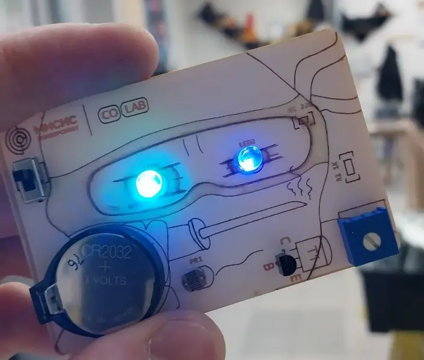
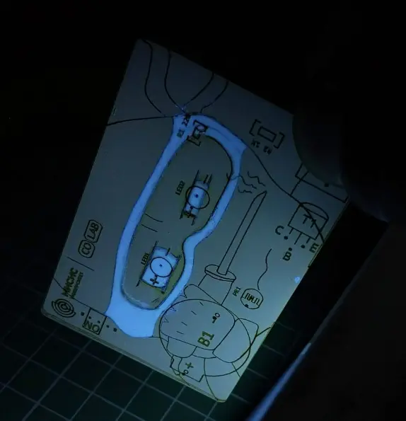

# 🥷 Solder Ninja — Тренировочный набор для пайки
Solder Ninja — полноценный функциональный сувенир, который объединяет в себе стильный дизайн и испытание для ваших навыков работы с паяльником. Соберите своего собственного ниндзя, который оживающего в темноте!
 
Набор создан для новичков и опытных радиолюбителей желающих отработать навыки монтажа как выводных (DIP), так и поверхностных (SMD) компонентов.

Изготовлены в Fablab методом ЧПУ фрезеровки. Повязка нанесена флуоресцентной краской и светится в темноте.
## Состав набора

- Готовая плата
- Транзистор
- Переменный резистор
- 2 светодиода 
- Держатель батарейки CR2032
- Фоторезистор
- SMD резистор 220 Ом
- SMD резистор 1 кОм
- Выключатель

## Состав репозитория

- `/NINJA_CAM` — файлы гравировки платы;
- шелкография и сопроводительная карточка в формате `.cdr` (CorelDRAW) 